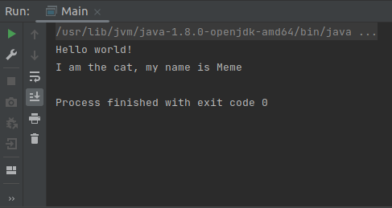

# Spring_1stAnnotationBean

a tiny project with Spring and an Annotation (bean): @Component

<html></html>

Project works on and with:

	- OS: Linux (Ubuntu 21.04) 64-bits;
	- IDEA Community Edition;
	- Spring Framework;
	- Maven build tools;
	- Java 8 (JDK 1.8).

## Launch the project

	- open the project in IDEA;
	- press alt + shift + F10 keys;
	- and see the result in the terminal:

<html></html>

## See (for details)

	- src/main/resources/applicationContext.xml
	- src/main/java/org/example/entites/Cat.java
	- src/main/java/org/example/Main.java

## Tags:
Spring, Application Context, Inversion of Control, Dependency Inversion, Beans, Annotation, @Component